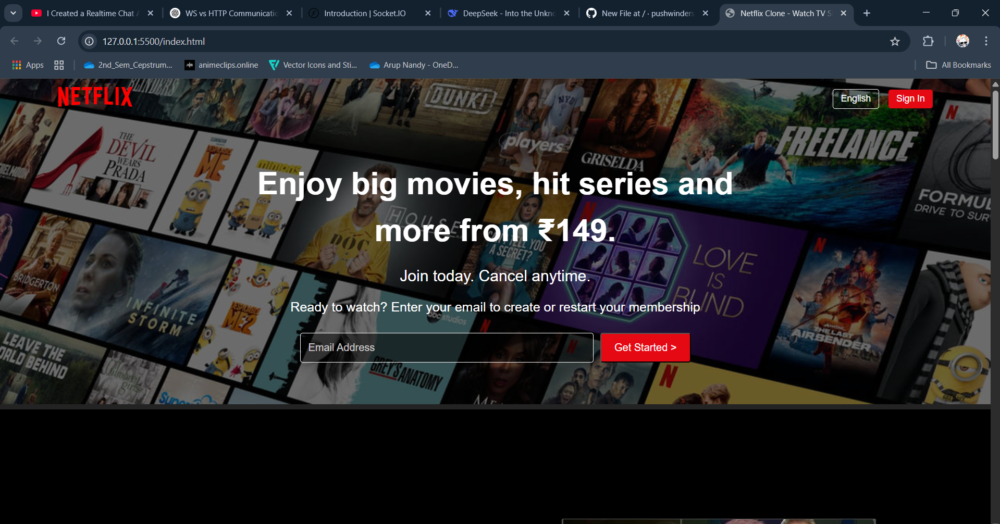

# Netflix Clone 🎬

A responsive Netflix clone built with modern web technologies, replicating the core UI/UX of the popular streaming platform.

## Features ✨

- **Authentic UI**: Faithful recreation of Netflix's iconic interface
- **Responsive Design**: Works flawlessly on all device sizes
- **Hero Banner**: Eye-catching featured content display
- **Email Signup**: Functional membership signup form
- **Content Rows**: Movie/series categories with horizontal scrolling
- **Hover Effects**: Interactive card animations like the original

## Technologies Used 🛠️

- **Frontend**: HTML5, CSS3, JavaScript
- **Styling**: Flexbox, CSS Grid, Media Queries
- **Design**: Pixel-perfect Netflix UI replication
- **Icons**: Font Awesome or similar icon library

netflix-clone/
├── assets/
│ ├── image/
│ └── css/
│── style.css
├── index.html
└── README.md
